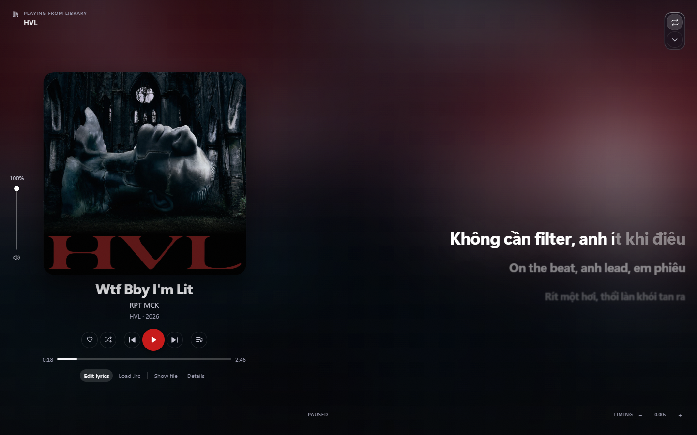
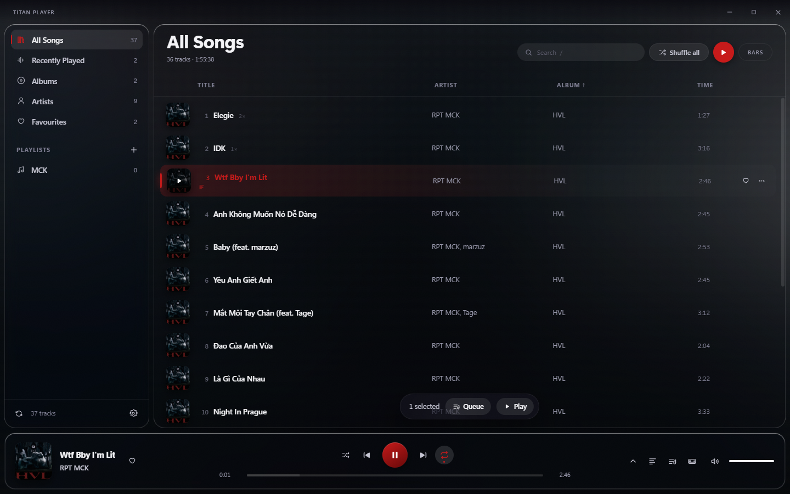
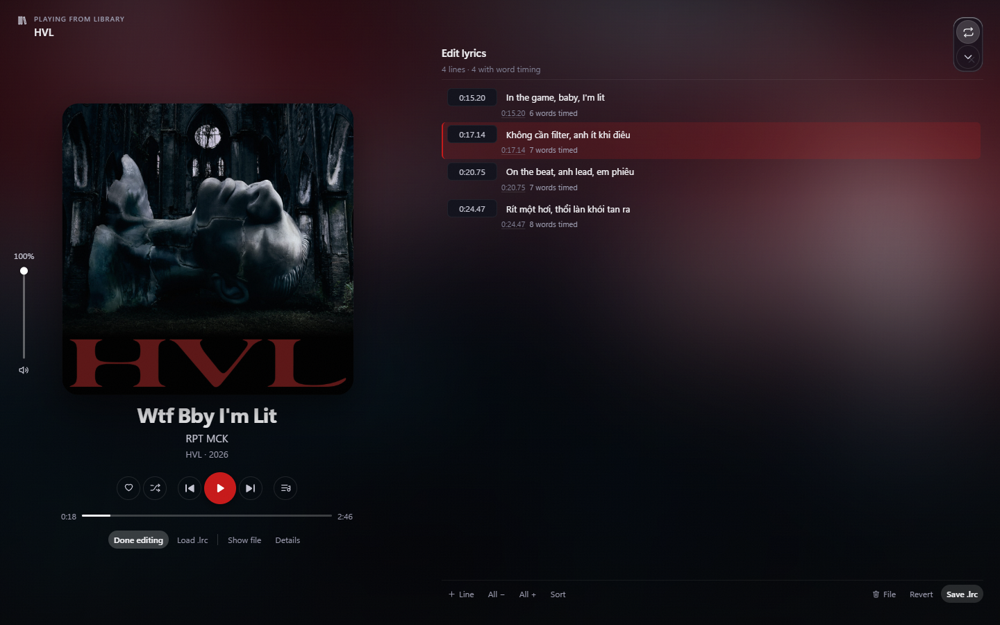
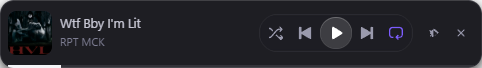

# Titan Player

A local music player for Windows, built with Electron and React. It reads the
tags of the audio files already on your disk — no streaming service, no account,
no network calls of any kind — and plays them in an interface built around the
album art.

Ships as both a portable `.exe` you can copy anywhere and a normal NSIS
installer.

  



---

## What it does

**Library**

- Scans the Windows Music folder automatically, plus any folders you add
- Recursive, with a bounded worker pool so a large library does not stall the app
- Reads MP3, FLAC, M4A/AAC, Ogg, Opus, WAV, WMA, AIFF, APE, WavPack and MP4 —
  all of which decode natively in Electron, so there is no bundled codec
- Artist, album, year, genre, track and disc numbers, bitrate, sample rate,
  channel count, file size, and lossless flag
- Search across title, artist, album, genre, year and track number, ignoring
  diacritics, so `muoi` finds `Mười`; sort by any field, ascending or
  descending; play count, duration and album views



**Artwork and colour**

- Embedded cover art, preferring the front cover over a back scan or band logo
- The dominant colour is extracted from the art and drives the accent colour and
  the ambient background gradient across the whole interface, continuously
  tracking whatever is playing
- Missing or unreadable art falls back to a tinted monogram rather than a grey box

**Lyrics**

- Read from the file's own tags, and from a `.lrc` file sitting beside it
- Understands `LYRICS`, `UNSYNCEDLYRICS` and `SYNCEDLYRICS` Vorbis comments,
  plus ID3 `USLT` and `SYLT` frames
- Parses plain LRC and word-level "enhanced" LRC
- A karaoke fill that sweeps continuously through the active line, including
  across wrapped lines, with no per-word DOM
- When a file *does* carry word-level timings, the fill follows the words rather
  than sweeping the line at a constant rate
- Click any line to seek to it; auto-scroll suspends while you scroll and
  resumes on its own
- Nudge the timing forward or back when a file's sync is off
- Falls back to a readable plain-text view when there is no timing data
- Load an external `.lrc` from anywhere without touching the audio file
- **Optional online lookup.** When a track has no lyrics in its tags and no `.lrc`
  beside it, Titan Player can ask [LRCLib](https://lrclib.net) for them. Off by
  default, because an automatic lookup tells a third-party server the artist,
  title and album of everything you play. Results are cached on your machine for
  a month, matched against the track's duration so a live take or a cover is not
  substituted for the studio version, and never replace lyrics the file already
- **An editor.** Correct a timing that is off, add lines that are missing, or tap
  the words along as the track plays to build word-level timing that almost no
  tagger writes. Saved as an `.lrc` beside the track — the audio file itself is
  never modified — and the pane then shows exactly what the file contains.

  carries. Turn it on in Settings, where the privacy tradeoff is spelled out.



**Player**

- Play, pause, previous, next, seek, volume, mute
- Shuffle, repeat off / all / one
- A queue panel that survives the track list being reordered underneath it
- "Play next", "add to queue", and multi-select queueing
- Frequency-bar visualiser driven from a Web Audio analyser
- Track details panel: full technical readout of the current file
- A full-screen now-playing view: the cover blown up and blurred behind the whole
  window, a vertical volume rail on the left edge, the transport and a seek bar
  inline under the artwork, and the lyrics opposite. The lyrics column is
  resizable by dragging or by arrow keys.
- A floating mini player — a second frameless window that stays above everything,
  with the transport, a seek bar and a volume control. It is a *remote control*,
  not a second player: there is no second copy of the audio, so it cannot drift
  out of sync with the main window the way two players on one clock always do.
- Keyboard: `Space` play/pause, `Shift+←/→` seek, `↑/↓` volume, `/` search,
  `Q` queue, `S` settings, `L` library, `Ctrl+Shift+M` mini player. `Esc` closes
  the queue panel and the now-playing view; it does nothing on the library itself.



**Listening history**

- A play count, a skip count, and the last time each track was heard, kept on your
  machine only
- A track counts as played once you reach halfway through it *or* four minutes,
  whichever comes first
- Decided on how much you actually listened, not on where playback reached — so
  skipping ahead and moving on does not count as a play
- A "Recently Played" view, and sorting by play count or by when you last heard a
  track

**Playlists**

- Create, rename, duplicate, delete
- Drag rows to reorder, or remove tracks from a playlist
- Favourites, kept separately from playlists
- Hide a track from the library views without losing it from a playlist
- Everything persists across restarts

---

## Install and run

Requires Node 24 or newer.

```sh
npm install
npm run dev
```

On Windows, if PowerShell refuses to run `npm`, use the `.cmd` shim:

```sh
npm.cmd install
npm.cmd run dev
```

### Build an executable

```sh
npm run build     # typecheck and bundle into out/
npm run dist      # produces both .exe files in release/
```

You end up with:

```
release/
├── titan-player-0.1.0-setup.exe      # NSIS installer
├── titan-player-0.1.0-portable.exe   # standalone, no install
└── win-unpacked/                     # unpacked directory, same code as the above
```

Or just the unpacked app directory, which is the fastest way to check a build:

```sh
npm run dist:dir
```

> If you ever run `npm ci` on a machine that blocks install scripts, approve
> them first with `npm install-scripts approve esbuild electron`. Without
> Electron's postinstall there is no `electron.exe` and the app cannot start.

---

## How it is put together

```
src/
├── shared/            types, the LRC reader *and* writer, the play-count rule
├── main/              Electron main process
│   ├── index.ts         window, IPC, navigation lockdown
│   ├── library.ts       folder walk, tag parsing, lyrics
│   ├── protocol.ts      the media:// scheme
│   ├── lyrics-write.ts  writes the .lrc sidecar, atomically
│   ├── listening.ts     the listening-history file
│   └── store.ts         atomic JSON persistence
├── preload/           the single contextBridge surface
└── renderer/          React UI
    ├── src/lib/       formatting, colour, the audio engine, Liquid Glass
    ├── src/state/     the store
    ├── src/mini/      the floating bar — a separate document, its own preload surface
    └── src/components/
```

### Three decisions worth explaining

**Cover art and audio are served over a custom `media://` protocol**, not sent
across the IPC bridge as base64. A 400 KB cover becomes roughly 533 KB of JSON
once base64-encoded, so a thousand-track library would push around half a
gigabyte through IPC on the first scan. The protocol also fixes a dev-mode
problem: in development the renderer is served from `http://localhost` and
cannot load a `file://` media source, so routing both through one scheme makes
development and production behave identically.

The audio side of the protocol is jailed to the folders you chose. A path that
resolves outside them gets a `403`, so a compromised renderer cannot read your
disk.

**Nothing is bundled to make decoding work.** FLAC, MP3, AAC and Ogg are all in
Chromium's codec set already, and Electron enables `proprietary_codecs`. The
tempting alternative, `ffmpeg.wasm`, would add around 65 MB and reimplement in
WebAssembly something Chromium already does in C++.

**Lyrics are written to a sidecar `.lrc`, never into the audio file.** The tag
reader available here reads tags and cannot write them, and rewriting a Vorbis
comment or an ID3v2 frame in place would mean a second tagger and a real risk of
damaging a file you care about. A sidecar is the same information in a file that
costs nothing to write and that you can open and correct in any text editor — so
when something goes wrong with the format, you have a way out that does not
involve this app.

### Security posture

- `contextIsolation` on, `nodeIntegration` off
- The renderer's entire API surface is one `contextBridge` object of plain
  serialisable values — no `fs`, no `Buffer`, no raw `ipcRenderer`
- The floating mini player is a separate document with its own, much smaller
  surface. It cannot scan, cannot reach settings, and cannot touch the filesystem,
  so the narrowest window in the app has the least reach.
- Writes are gated on the same path jail that serves audio, so the renderer can
  only write beside a track you can already play
- A Content-Security-Policy that does not need a `data:` hole, because media
  comes from the custom scheme
- `will-navigate` and `setWindowOpenHandler` both locked down, so the shell
  cannot navigate away or open windows
- The app runs `asInvoker` and never requests elevation

---

## Known limitations

- **Word-level lyric timing is rare in local files.** FLAC stores lyrics as LRC
  text in a Vorbis comment, which is line-level only. Word timing needs
  "enhanced" LRC, which few taggers write. Where it is present the fill follows
  the words; otherwise the fill is distributed across the line. The line-level
  path is the guarantee, not a fallback. The editor can create the word timings by
  hand — tapping each word as it is sung — which is a few seconds of work per
  line and writes an Enhanced LRC beside the track.
- **A malformed cover-art block can make a FLAC unplayable.** Chromium's FLAC
  demuxer rejects the whole file when a `METADATA_BLOCK_PICTURE` block has a bad
  MIME type, even though the audio is fine. The player surfaces this as an
  error rather than failing silently.
- Tracks are re-read on every scan. There is no incremental cache, so scanning a
  very large library takes a few seconds each time.
- No gapless playback or crossfade. There is an audible gap between tracks, and
  the first fraction of a second of each is spent seeking.
- No loudness normalisation. `REPLAYGAIN` and `R128` tags are neither read nor
  applied, so switching between a quiet folk recording and a loud EDM master at a
  fixed volume is as uneven here as it is in any player without the feature.
- No scrobbling and no audio equaliser. Last.fm scrobbling is the obvious
  omission: it needs an API key from you, and it is the one feature here that
  sends your listening somewhere.
- Duplicate files across folders are not detected. Two copies of the same album in
  two folders appear as two albums.

---

## Licence

AGPL-3.0-or-later. See [LICENSE](LICENSE) for the full text and
[NOTICE.md](NOTICE.md) for attribution.

It was MIT until the Liquid Glass surface and the lyrics presentation were brought
in. Those come from Spicetify modifications — Wave Player (MIT) for the lyrics,
and Liquify / spicetify-glassify (**AGPL-3.0**) for the glass — and deriving from
AGPL code makes the whole work AGPL. The lyrics came from an MIT project, so if
the glass is ever rewritten from the technique alone the licence can go back to
MIT; `RESEARCH-SPICETIFY-REFERENCES.md` records enough detail to do that.
